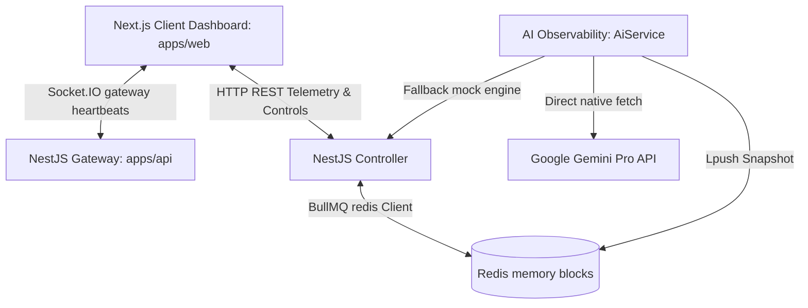
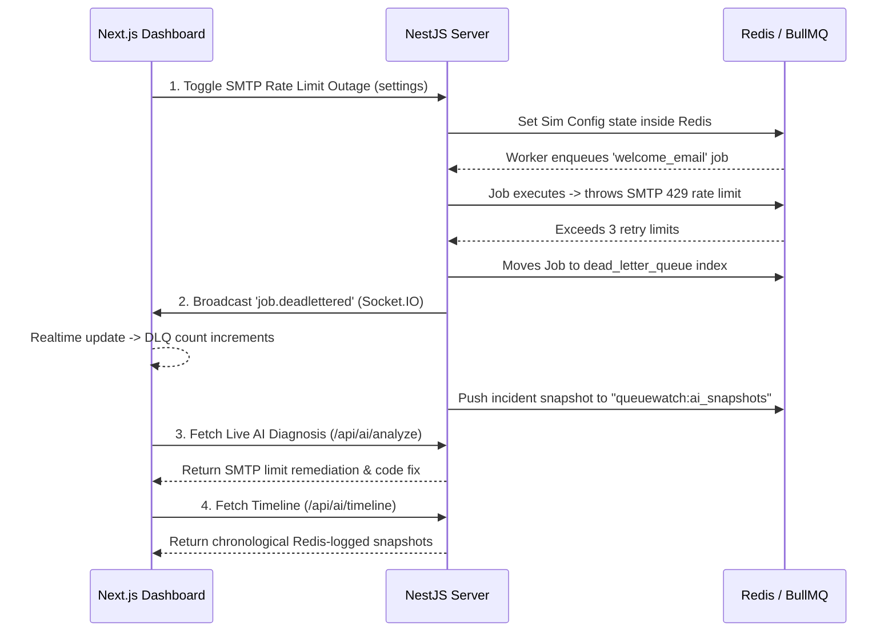

# QueueWatch Observability Engine 🚀

```
   ____                       __      __    _      
  / __ \__  _____  __  ______/ /_  __/ /_  (_)___  
 / / / / / / / _ \/ / / / __  / / / / __/ / / __ \ 
/ /_/ / /_/ /  __/ /_/ / /_/ / /_/ / /_  / / /_/ / 
\___\_\__,_/\___/\__,_/\__,_/\__,_/\__/ /_/\____/  
   AI-Powered Telemetry Observability for BullMQ + Redis
```

QueueWatch is an enterprise-grade, real-time AI observability and diagnostics platform designed specifically for asynchronous BullMQ and Redis job architectures. Built 100% database-free, it operates natively on Redis memory streams to capture latencies, throughput ticks, trace exception stack logs, and dead-letter growth.

---

## 🏗️ Monorepo E2E Architecture



---

## ⚙️ Monorepo Folder Layout

```bash
├── apps/
│   ├── web/             # Next.js 14+ dark-mode SaaS dashboard (Port 3000)
│   └── api/             # NestJS API, BullMQ workers, error injectors (Port 3001)
├── packages/
│   └── shared/          # Shared TypeScript type boundaries and telemetry models
├── docker-compose.yml   # Optimized Redis alpine container setup (Port 6379)
├── pnpm-workspace.yaml  # Declares monorepo package workspace domains
├── tsconfig.json        # Base monorepo compiler settings
├── eslint.config.mjs    # Monorepo flat-file linting rules
└── prettier.config.js   # Code styling guidelines
```

---

## 🛠️ Step-by-Step E2E Setup & Verification

Follow these commands from the root directory to boot the complete stack:

### 1. Prerequisites
Ensure you have the following installed on your machine:
- **Node.js** (v18.0.0 or higher)
- **pnpm** (installed globally: `npm install -g pnpm`)
- **Docker & Docker Compose** (running)

### 2. Boot Local Redis Broker
Spin up the lightweight, snapshot-disabled Redis container:
```bash
pnpm redis:up
```

### 3. Install Monorepo Dependencies
Install all package boundaries concurrently:
```bash
pnpm install
```

### 4. Build Shared Package Contracts
Compile `@queuewatch/shared` declaration templates:
```bash
pnpm build
```

### 5. Launch the Monorepo Development Environment
Boot both Next.js and NestJS concurrently:
```bash
pnpm dev
```

- **Frontend SaaS Dashboard**: [http://localhost:3000](http://localhost:3000)
- **Interactive Swagger Docs**: [http://localhost:3001/api/docs](http://localhost:3001/api/docs)
- **Backend API Health**: [http://localhost:3001/api/health](http://localhost:3001/api/health)

---

## 📖 E2E Telemetry Sequence Diagram



---

## 🚨 Playbook: Hackathon Demo Scenarios

Walk through these intentional failure scenarios to demonstrate QueueWatch’s complete capabilities:

### Scenario 1: Stripe Webhook Timeout Outage
1. **Trigger Outage**: Navigate to [http://localhost:3000/settings](http://localhost:3000/settings) (Outage Controls) and toggle the **Stripe Webhook Outage** switch to **ON**.
2. **Observe live warning**: Head to [http://localhost:3000](http://localhost:3000). The **AI Observability Insights** card will instantly flash a **CRITICAL** warning, highlighting that Stripe APIs are experiencing HTTP 503 gateway timeouts.
3. **Verify AI Remedy**: The insight card dynamically outputs a copyable Node.js code block recommending an **Opossum Circuit Breaker** integration to protect execution threads.
4. **Trace Timeline**: Open the [Incident Registry Timeline](http://localhost:3000/incidents) and switch to the **AI Reliability Timeline** tab. An expandable event card has been appended to the chronology list, tracking the Stripe webhook failure.

### Scenario 2: Zod Payload Mismatch
1. **Trigger Anomaly**: Head to [http://localhost:3000/settings](http://localhost:3000/settings). In the **Manual Payload Dispatcher** on the right side, select **image_processing_queue** as the target.
2. **Dispatch Malformed Data**: Click **Trigger invalid schema mock** (this deletes the required `imageUrl` parameter). Click **ENQUEUE JOB**.
3. **Audit Job Exception**: Go to [http://localhost:3000/incidents](http://localhost:3000/incidents). Expand the newly added failed job row. It displays the exact Zod schema error stack: `InvalidPayloadError: Schema validation failed. Missing required parameter 'imageUrl'`.
4. **AI Resolution Blueprint**: Review the AI resolution card directly inside the expanded incident row. It displays a copyable **Zod pre-enqueue validation schema** to block malformed parameters before they consume Redis ticks.

### Scenario 3: SMTP Rate Limit Block & DLQ Replay
1. **Trigger Outage**: In Outage Controls, toggle **SendGrid SMTP Outage (429)** to **ON**.
2. **Exceed Retries**: The continuous background traffic generator will enqueue welcome emails which fail under backoff limits. Once a job exceeds 3 attempts, the worker automatically relocates the metadata to the **Dead-Letter Queue (DLQ)**.
3. **Verify Real-time Socket Logs**: Watch the rolling **Realtime Activity Feed** on the dashboard home. It streams a flashing red `DLQ` badge log: `Job permanently failed! Routed to Dead-Letter Queue.`
4. **Replay Job**: Go to [http://localhost:3000/dead-letter](http://localhost:3000/dead-letter). Expand the failed job in the **Dead Letter table** to inspect raw parameters.
5. **Operational Recovery**: In [Outage Controls](http://localhost:3000/settings), click **RECOVER ALL WORKERS** to clear simulated errors. Now return to the DLQ table and click **Replay Job**. The record vanishes and is immediately re-enqueued, successfully completing in active workers!

---

## 📹 Hackathon Submission & Media Guidance

To make your submission stand out, capture E2E operational animations:

1. **Demonstrate Sockets (GIF)**: Capture the main dashboard overview side-by-side with the Outage Injector Panel. Toggle the **Traffic Generator** and record the live heartbeats pulsing, metric cards incrementing, and activity feed streaming.
2. **Highlight AI Insight panels (Screenshot)**: Capture a high-contrast screenshot of the **AI Observability Insights** card with multiple active outages, showing the terminal-styled copyable proposed fixes and color-coded severity badges.
3. **Audit Incidents Tab (Video)**: Record a short 30-second walkthrough:
   - Navigate to the **Incident Registry**.
   - Expand a failed job to reveal the exception callstack and payload parameters.
   - Click the **AI Reliability Timeline** tab to display past system snapshots chronologically.
