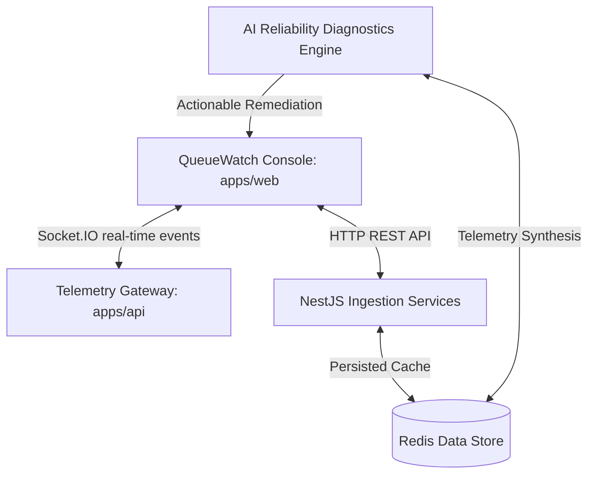

# QueueWatch

**AI-powered operational intelligence and diagnostics for modern distributed systems.**

```
   ____                       __      __    _      
  / __ \__  _____  __  ______/ /_  __/ /_  (_)___  
 / / / / / / / _ \/ / / / __  / / / / __/ / / __ \ 
/ /_/ / /_/ /  __/ /_/ / /_/ / /_/ / /_  / / /_/ / 
\___\_\__,_/\___/\__,_/\__,_/\__,_/\__/ /_/\____/  
   Operational Intelligence & Diagnostics Platform
```

---

## What is QueueWatch?

QueueWatch is an AI-powered operational intelligence and diagnostics platform built to help modern engineering teams observe, diagnose, understand, and eventually automate reliability across distributed systems. 

Unlike traditional monitoring tools that merely flag when a system is down, QueueWatch collects distributed events, queue execution cycles, and worker telemetry, turning raw logs and traces into actionable remediation blueprints. By combining real-time event correlation with our specialized SRE Diagnostics Engine, QueueWatch provides immediate root-cause synthesis and copy-paste repair instructions for system anomalies.

---

## The Problem

Modern architectures produce an overwhelming volume of telemetry:
* System logs and console errors
* Metric time-series and queue throughput counts
* Distributed traces and API boundaries
* Background worker execution states

When a critical worker stalls or a payment queue starts failing, SRE and platform teams can see *that* a failure has occurred, but they are left with difficult questions:
* **Why** did it happen? (e.g., Is it an external API timeout, database lock, or memory leak?)
* **Where** did it start? (Did the failure originate in the webhook intake or downstream queue workers?)
* **What** is the business impact? (Which users, payments, or actions are stalled?)
* **How** do we fix it? (What code, environment configurations, or runbooks should be executed?)

QueueWatch solves this by sitting at the intersection of queue telemetry and AI analysis, correlating execution traces with historical runbooks to restore systems immediately.

---

## Core Platform Capabilities

### 👁️ Observe
Ingest real-time telemetry from background workers, message queues, and microservice events. Track latency, throughput, execution status, and stalled processes in a single pane of glass.

### 🔍 Detect
Continuously analyze event pipelines for execution anomalies, rate-limiting bottlenecks, and memory leaks. Catch failures before they trigger user-facing outages.

### 🩺 Diagnose
Map service dependencies dynamically. Correlate upstream failures with downstream queue delays, track Trace IDs across network bounds, and isolate root causes in seconds.

### 🛡️ Resolve
Generate context-aware remediation proposals, including copy-paste code patches, automated runbook steps, and historical resolution paths.

### 💬 Copilot (Planned)
Conduct interactive incident troubleshooting via our reliability console. Query the AI engine using natural language to extract diagnostics, compile logs, and trigger automated failovers.

---

## Production Architecture



---

## How QueueWatch Works

1. **Create Workspace**: Initialize your administrator console space.
2. **Provision Projects**: Group your services and background architectures into isolated project domains.
3. **Generate SDK Keys**: Retrieve secure API credentials to authorize telemetry streams.
4. **Install Node.js SDK**: Integrate the lightweight telemetry agent in your application workers.
5. **Ingest Telemetry**: Heartbeats and worker state logs are transmitted asynchronously without impacting primary execution threads.
6. **Analyze Pipelines**: The QueueWatch engine processes event logs, maps dependencies, and checks rules.
7. **Access Insights**: Receive interactive diagnostic dashboards, real-time alert logs, and SRE playbooks.

---

## Supported Systems

QueueWatch is built to be engine-agnostic. While NestJS, Redis, and BullMQ represent our first-class production integration, our pipeline is expanding to support the broader event-driven ecosystem:

* **Current**:
  * BullMQ / Redis Queues
* **Planned**:
  * RabbitMQ
  * Apache Kafka
  * Amazon SQS
  * Redis Streams
  * Webhook Listeners
  * Cron & Scheduled Jobs
  * Custom HTTP/gRPC Telemetry Ingestion

---

## AI Reliability Engine

QueueWatch features a specialized AI diagnostics layer that interprets runtime execution patterns:

* **Current Capabilities**:
  * **Incident Classification**: Auto-tags failures by severity, affected queue, and subsystem.
  * **Root Cause Summarization**: Condenses complex multi-line exception stack traces into readable text summaries.
  * **Business Impact Assessment**: Evaluates data stagnation and calculates affected transaction metrics.
  * **Actionable Remediation**: Proposes explicit code improvements (e.g., circuit-breaker patterns, validation overrides).

* **Planned Capabilities**:
  * **Autonomous Incident Investigation**: Independent log correlation and database locks analysis.
  * **Interactive Reliability Copilot**: Chat-based environment checks and SRE queries.
  * **Automated Runbook Execution**: Auto-triggering repair scripts when specific alerts fire.

---

## SDK Integration

Integrate queue monitoring into your Node.js application in seconds.

### 1. Installation

```bash
npm install @queuewatch/node
```

### 2. Initialization

Configure the SDK wrapper to monitor execution states and transmit trace heartbeats:

```javascript
import { Queue } from 'bullmq';
import { monitorQueue, queuewatchLogger } from '@queuewatch/node';

const transactionQueue = new Queue('payment_processing');

// Initialize telemetry collection
monitorQueue(transactionQueue, {
  projectId: 'proj_your_project_id',
  apiKey: 'qw_your_secret_api_key',
  queueName: 'payment_processing',
  endpoint: 'https://api.queuewatch.io', // or http://localhost:3001 for local dev
});

// Logs are automatically captured and linked to the active job trace
queuewatchLogger.info('Stripe checkout session initialized', {
  queueName: 'payment_processing',
  jobId: 'job_849201',
  userId: 'usr_902',
});
```

---

## Product Vision

QueueWatch is evolving from simple queue observability into comprehensive **operational intelligence**. 

```
  Observe ──> Diagnose ──> Recommend ──> Automate
```

Our eventual goal is to build an autonomous **AI Reliability Engineer** that continually audits distributed queues, runs preventative chaos simulation, recommends architecture fixes, and assists development teams in maintaining zero-downtime operations.

---

## Local Development

Configure and launch the entire QueueWatch stack locally:

### 1. Prerequisites
Ensure you have the following installed on your machine:
* **Node.js** (v18.0.0 or higher)
* **pnpm** (installed globally: `npm install -g pnpm`)
* **Docker & Docker Compose** (running)

### 2. Boot Local Redis Broker
Spin up the lightweight, snapshot-disabled Redis container:
```bash
pnpm redis:up
```

### 3. Install Monorepo Dependencies
Install all package boundaries concurrently:
```bash
pnpm install
```

### 4. Build Shared Package Contracts
Compile `@queuewatch/shared` declaration templates:
```bash
pnpm build
```

### 5. Launch the Monorepo Development Environment
Boot both Next.js and NestJS concurrently:
```bash
pnpm dev
```

* **Frontend SaaS Console**: [http://localhost:3000](http://localhost:3000)
* **Interactive Swagger Docs**: [http://localhost:3001/api/docs](http://localhost:3001/api/docs)
* **Backend API Health**: [http://localhost:3001/api/health](http://localhost:3001/api/health)

---

## Contributing

We welcome contributions to QueueWatch. If you want to contribute, please follow our guidelines:
1. Fork the repository.
2. Create a feature branch (`git checkout -b feature/amazing-feature`).
3. Commit your changes (`git commit -m 'Add amazing feature'`).
4. Push to the branch (`git push origin feature/amazing-feature`).
5. Open a Pull Request.

Ensure all tests pass and that lint rules are satisfied by running `pnpm lint`.

---

## License

QueueWatch is licensed under the MIT License. See [LICENSE](LICENSE) for details.
